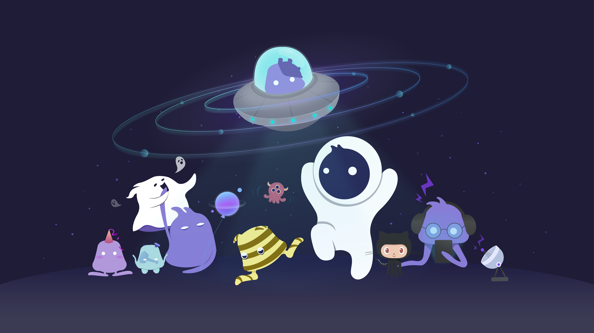
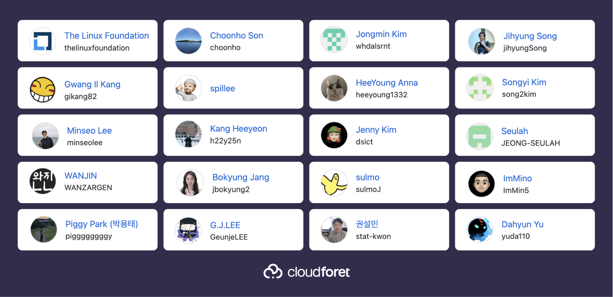

# Cloudforet Brand Design & Assets

[Cloudforet](https://cloudforet.io) is an open source project for enabling integrated management of multi-clouds. 
In this `/artwork` repository contains Cloudforet brand assets including logos, characters, illustrations and more.

---

### [Logos](logo)

Cloudforet logos consist of symbols and wordmarks that symbolize Cloudforet.
Each symbols and the wordmarks can be used according to [Cloudforet brand guidelines](./logo/brand%20guide), or use both together to represent Cloudforet brand image and naming.

Designed By [h22y25n](https://github.com/h22y25n) and [heeyoung1332](https://github.com/heeyoung1332)

---

### Woniverse

‘Woniverse’ is Cloudforet’s worldview set in Universe(from multi-clouds to entire IT infrastructure).

In a cloud world as wide and deep as the universe, it is easy to get lost.
Event if just one thing goes wrong, will be going into the black hole.

Wonny, which has existed after the universe was born, knows all about the world.
Besides, there are Jelly Octoz by Wonny’s side.
If you are exploring the universe with Wonny and Jelly Octos, you can safely and easily explore the world as you want.

#### [Wonny](woniverse/wonny)

* Wonny is omnipotent in the cloud world.
* Wonny made himself look like an astronaut to commnicate friendly with the people on Earth.
* Wonny likes to collect planets and decorate galaxies.
* Wonny hates surveillance cameras. 
He has heard someone say that Wonny and the surveillance cameras looked alike, and perhaps he disagrees.

Designed by [dsict](https://github.com/dsict)

#### [Jelly Octos](woniverse/jellyotos)

* Jelly Octos love Wonny, and they often help Wonny with his work.
* Jelly Octos can’t do many things at once. They prefer to do one thing at a time.
* Each Jelly Octos has its own unique talent.

Designed By [daesupkim](https://github.com/daesupkim)

#### Character Donation 

Do you want to help others better understand the cloud environments and express the adventures of the cloud world?
Donate characters to Woniverse! 
If you want to donate a character, send an email to the address below, including the character design.

* [admin@cloudforet.io](mailto:admin@cloudforet.io)

#### Character License
Wonny and Wonny’s Friends(Jelly Otos) are licensed under the Creative Commons Attribution License(CC BY 4.0). You can remix, transform, and build upon the materials for any purpose, even commercially. If you use the materials, including the text “cloudforet.io” to provide attribution. If possible, Apply a link to https://cloudforet.io

---

### [Illustrations](./illustrations)

Express the adventures of the cloud world with Wonny and Jelly Octos.

---

### Introducing CloudONE Team

Introducing CloudONE team which is leading Cloudforet project with Wonny. 

Together, we make OUR UNIVERSE a better place that
changes the way you operate IT infrastructure across
on-premise and multi-clouds.

* [Contribution Guide](https://cloudforet.io/docs/developers/contribute/)

Copyright © Cloudforet a Series of [LF Projects](https://www.linuxfoundation.org/), LLC
